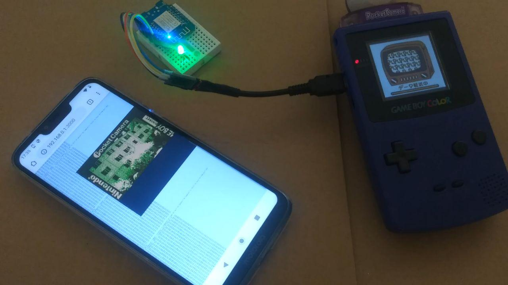

# Websocket GBP Emulator

A GameBoy printer emulator which provides the received data over a websocket.
This code has been created for a "LOLIN(WEMOS) D1 R2 & mini" [ESP2866 based board](https://github.com/esp8266/arduino).   
For uploading the Filesystem the LittleFS tool [Arduino IDE Plugin](https://github.com/earlephilhower/arduino-esp8266littlefs-plugin/releases) is required

## Links / Research
* Original GPB-Emulator by [mofosyne: Arduino Gameboy Printer Emulator](https://github.com/mofosyne/arduino-gameboy-printer-emulator)  
* Tutorial on how to implement Websockets with an ESP2866 by [ttapa: WebSocket communication](https://tttapa.github.io/ESP8266/Chap14%20-%20WebSocket.html)  
* Potentially faster library for data transfer [applefreak/esp8266-gameboy-printer](https://github.com/applefreak/esp8266-gameboy-printer)
* ESP2866 D1 Mini [Pinout](https://escapequotes.net/esp8266-wemos-d1-mini-pins-and-diagram/)
* SPIFFS/LittleFS [Filesystem Docs](https://arduino-esp8266.readthedocs.io/en/latest/filesystem.html)
* [Link cable breakout board](https://github.com/Palmr/gb-link-cable)

## ToDo's
* ~~[mDNS](https://tttapa.github.io/ESP8266/Chap08%20-%20mDNS.html)~~
* ~~Webserver serving a static Web-Application (will be in a [different Repository](https://github.com/HerrZatacke/gb-printer-web))~~

## Done
* ~~Websockets serving received printer packages~~
* Websocket implementation has been removed due to performance issues, instead the ESP should now detect the presence of the GameBoy over it's 5V signal. and Either Boot in "server" or "printer" mode  

## Demo Video
⚠ Obviusly you should not power the ESP from the GameBoy, as this might damage the GameBoy itself.

